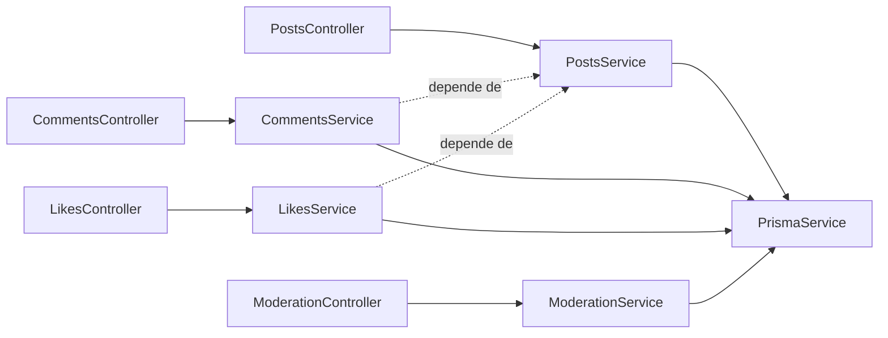
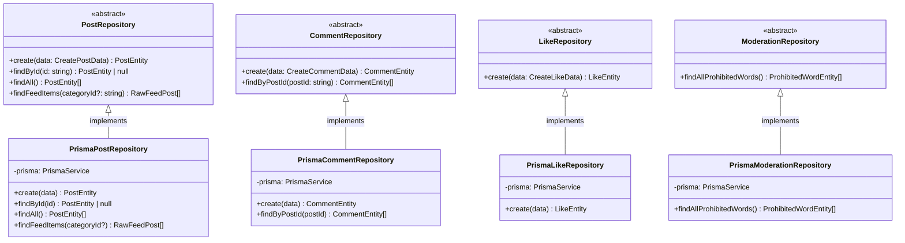
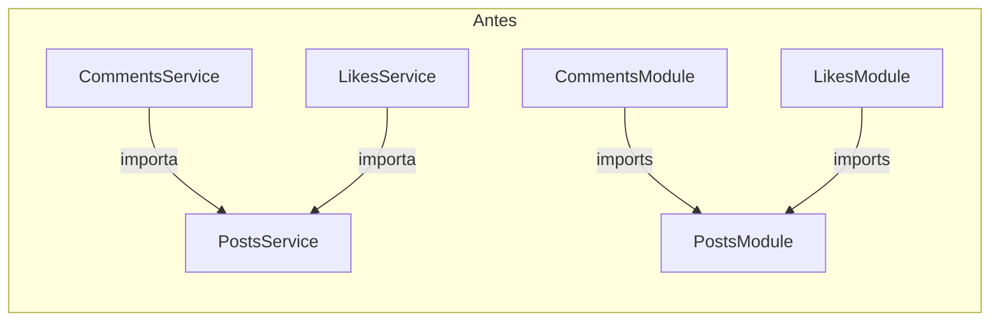
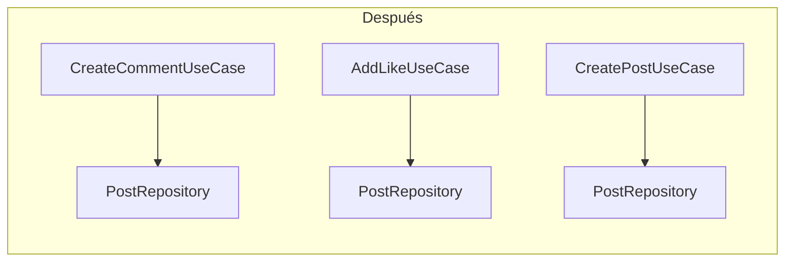
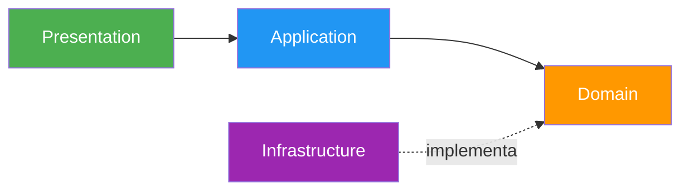

# Auditoría Técnica y Refactorización a Clean Architecture

## Resumen Ejecutivo

Este proyecto es una API NestJS funcional con un patrón modular básico y buena validación de entrada. Sin embargo, en su diseño original presenta mezclas claras de infraestructura y dominio, dependencias directas hacia Prisma y responsabilidades demasiado amplias en los servicios. Se identificaron **7 problemas principales** y se implementaron soluciones basadas en **Clean Architecture** para cada uno.

---

## Arquitectura Original

El sistema estaba construido como un monolito NestJS con módulos por característica. El flujo típico era:

```
Controlador → Servicio → PrismaService → Base de datos
```

Toda la lógica de negocio, validación, moderación y acceso a datos estaba concentrada en los servicios (`PostsService`, `CommentsService`, `LikesService`, `ModerationService`).



---

## Problemas Identificados y Soluciones

### Problema 1: Dependencias de infraestructura dentro del dominio

**Descripción:** `PostsService`, `CommentsService`, `LikesService` y `ModerationService` usaban directamente `PrismaService` para leer/escribir datos. En Clean Architecture, la capa de dominio/aplicación no debe depender de detalles de infraestructura como Prisma.

**Solución:** Se introdujo la **Inversión de Dependencias (DIP)** mediante repositorios abstractos. Los casos de uso ahora dependen de abstracciones, no de implementaciones concretas.

```typescript
// ANTES: El servicio depende directamente de Prisma (infraestructura)
export class PostsService {
    constructor(private readonly prisma: PrismaService) {}

    create(data: CreatePostDto) {
        // moderación + persistencia mezclados
        return this.prisma.post.create({ data })
    }
}

// DESPUÉS: El caso de uso depende de abstracciones (dominio)
export class CreatePostUseCase {
    constructor(
        private readonly postRepository: PostRepository,           // abstracto
        private readonly moderationRepository: ModerationRepository, // abstracto
        private readonly moderationService: ModerationDomainService, // dominio
    ) {}

    async execute(data: CreatePostDto) {
        const prohibitedWords = await this.moderationRepository.findAllProhibitedWords()
        const moderation = this.moderationService.moderate(text, prohibitedWords)
        if (!moderation.approved) throw new BadRequestException(moderation.reason)
        return await this.postRepository.create(data)
    }
}
```

---

### Problema 2: Ausencia de repositorios y abstracciones

**Descripción:** No existían interfaces `PostRepository`, `CommentRepository`, `LikeRepository`, ni `ModerationRepository`. El acceso a datos estaba acoplado a Prisma en cada servicio.

**Solución:** Se crearon **4 repositorios abstractos** en la capa de dominio y sus **implementaciones concretas** en la capa de infraestructura.



Los repositorios se definen como `abstract class` (en vez de `interface`) para permitir que NestJS los use como tokens de inyección de dependencias:

```typescript
// Dominio: src/domain/repositories/post.repository.ts
export abstract class PostRepository {
    abstract create(data: CreatePostData): Promise<PostEntity>
    abstract findById(id: string): Promise<PostEntity | null>
    abstract findAll(): Promise<PostEntity[]>
    abstract findFeedItems(categoryId?: string): Promise<RawFeedPost[]>
}

// Infraestructura: src/infrastructure/repositories/prisma-post.repository.ts
@Injectable()
export class PrismaPostRepository extends PostRepository {
    constructor(private readonly prisma: PrismaService) { super() }
    // ... implementaciones concretas con Prisma
}

// Módulo: Binding en NestJS
{ provide: PostRepository, useClass: PrismaPostRepository }
```

---

### Problema 3: Falta de casos de uso explícitos

**Descripción:** La lógica de negocio estaba dispersa en servicios de NestJS. No existía capa `application/use-cases` que representara acciones del sistema.

**Solución:** Se crearon **6 casos de uso** en `src/application/use-cases/`:

```mermaid
classDiagram
    class CreatePostUseCase {
        -postRepository: PostRepository
        -moderationRepository: ModerationRepository
        -moderationService: ModerationDomainService
        +execute(data: CreatePostDto) PostEntity
    }

    class ListPostsUseCase {
        -postRepository: PostRepository
        +execute() PostEntity[]
    }

    class GetFeedUseCase {
        -postRepository: PostRepository
        -feedRankingFactory: FeedRankingStrategyFactory
        -feedPostMapper: FeedPostMapper
        +execute(mode: FeedMode, categoryId?: string) FeedPost[]
    }

    class CreateCommentUseCase {
        -postRepository: PostRepository
        -commentRepository: CommentRepository
        -moderationRepository: ModerationRepository
        -moderationService: ModerationDomainService
        +execute(postId: string, data: CreateCommentDto) CommentEntity
    }

    class ListCommentsUseCase {
        -postRepository: PostRepository
        -commentRepository: CommentRepository
        +execute(postId: string) CommentEntity[]
    }

    class AddLikeUseCase {
        -postRepository: PostRepository
        -likeRepository: LikeRepository
        +execute(postId: string, data: AddLikeDto) LikeEntity
    }

    CreatePostUseCase --> PostRepository
    CreatePostUseCase --> ModerationRepository
    CreatePostUseCase --> ModerationDomainService
    ListPostsUseCase --> PostRepository
    GetFeedUseCase --> PostRepository
    CreateCommentUseCase --> PostRepository
    CreateCommentUseCase --> CommentRepository
    ListCommentsUseCase --> PostRepository
    ListCommentsUseCase --> CommentRepository
    AddLikeUseCase --> PostRepository
    AddLikeUseCase --> LikeRepository
```



Cada caso de uso tiene una **única responsabilidad**: orquestar la operación sin conocer detalles de infraestructura.

---

### Problema 4: Responsabilidades mezcladas

**Descripción:** Los servicios mezclaban múltiples responsabilidades:
- `PostsService.create()`: validaba/moderaba texto **y** persistía el post.
- `CommentsService.create()`: validaba existencia de post, moderaba contenido **y** persistía el comentario.
- `ModerationService.moderate()`: consultaba palabras prohibidas **y** construía regex difusa.

**Solución:** Se separó cada responsabilidad en su propia clase:

| Responsabilidad | Antes (todo en el servicio) | Después (separado) |
|---|---|---|
| Moderación de texto | `ModerationService.moderate()` | `ModerationDomainService.moderate()` |
| Consulta de palabras prohibidas | `ModerationService.moderate()` | `ModerationRepository.findAllProhibitedWords()` |
| Persistencia de posts | `PostsService.create()` | `PostRepository.create()` |
| Orquestación crear post | `PostsService.create()` | `CreatePostUseCase.execute()` |
| Validación existencia post | `CommentsService.create()` | `PostRepository.findById()` en el use case |
| Persistencia de comentarios | `CommentsService.create()` | `CommentRepository.create()` |

```typescript
// ANTES: ModerationService mezcla consulta + lógica
export class ModerationService {
    async moderate(text: string) {
        const words = await this.prisma.prohibitedWord.findMany()  // consulta DB
        for (const pw of words) {                                   // lógica de negocio
            const regex = buildFuzzyRegex(pw.word)
            if (regex.test(text)) return { approved: false, reason: ... }
        }
        return { approved: true }
    }
}

// DESPUÉS: Separado en repositorio (consulta) + servicio de dominio (lógica)
export class ModerationDomainService {        // Solo lógica de negocio
    moderate(text: string, prohibitedWords: ProhibitedWordEntity[]) {
        for (const pw of prohibitedWords) {
            const regex = buildFuzzyRegex(pw.word)
            if (regex.test(text)) return { approved: false, reason: ... }
        }
        return { approved: true }
    }
}
```

---

### Problema 5: Acoplamiento entre servicios

**Descripción:** `CommentsService` y `LikesService` dependían de `PostsService.findById()` para validar existencia de post. Esto creaba una dependencia innecesaria servicio-a-servicio.



**Solución:** Cada módulo ahora inyecta su propio `PostRepository` directamente, eliminando la dependencia servicio-a-servicio:



```typescript
// ANTES: LikesModule importaba PostsModule para acceder a PostsService
@Module({
    imports: [PostsModule],  // ← acoplamiento módulo-a-módulo
    providers: [LikesService],
})
export class LikesModule {}

// DESPUÉS: LikesModule inyecta PostRepository directamente
@Module({
    controllers: [LikesController],
    providers: [
        AddLikeUseCase,
        { provide: PostRepository, useClass: PrismaPostRepository },
        { provide: LikeRepository, useClass: PrismaLikeRepository },
    ],
})
export class LikesModule {}
```

Ningún módulo de negocio importa otro módulo de negocio.

---

### Problema 6: Lógica de negocio mezclada con infraestructura

**Descripción:** Transformaciones como `likesCount`, `commentsCount`, `relevanceScore` estaban en `PostsService.getFeedPosts()`. El servicio combinaba consulta de datos con cálculos de presentación.

**Solución:** Se creó un `FeedPostMapper` en la capa de dominio y un `GetFeedUseCase` en la capa de aplicación:

```typescript
// ANTES: PostsService.getFeedPosts() hacía query + cálculos
async getFeedPosts(categoryId?: string) {
    const posts = await this.prisma.post.findMany({ include: { ... } })  // infra
    return posts.map(post => ({                                            // negocio
        ...post,
        likesCount: post.likes.reduce((sum, l) => sum + l.weight, 0),
        commentsCount: post.comments.length,
        relevanceScore: likesCount * 2 + commentsCount,
    }))
}

// DESPUÉS: Separado en mapper (dominio) + use case (aplicación) + repository (infra)
// 1. Mapper (dominio): solo calcula scores
export class FeedPostMapper {
    toFeedPost(raw: RawFeedPost): FeedPost {
        const likesCount = raw.likes.reduce((sum, l) => sum + l.weight, 0)
        const commentsCount = raw.comments.length
        return { ...raw, likesCount, commentsCount, relevanceScore: likesCount * 2 + commentsCount }
    }
}

// 2. Use case (aplicación): orquesta
export class GetFeedUseCase {
    async execute(mode: FeedMode, categoryId?: string) {
        const rawPosts = await this.postRepository.findFeedItems(categoryId)  // infra
        const feedPosts = this.feedPostMapper.toFeedPosts(rawPosts)            // dominio
        return this.feedRankingFactory.forMode(mode).rank(feedPosts)           // dominio
    }
}
```

---

### Problema 7: Patrón Strategy mal extendido

**Descripción:** `FeedRankingStrategyFactory.forMode()` usaba una cadena de condicionales `if/else` para seleccionar la estrategia de ranking. Esto violaba el principio **Open/Closed (OCP)**: agregar un nuevo modo requería modificar la fábrica.

**Solución:** Se implementó un registro dinámico con `Map`:

```typescript
// ANTES: Cadena de if/else — viola OCP
forMode(mode: string): FeedRankingStrategy {
    if (mode === "latest") return new LatestRankingStrategy()
    if (mode === "mostLiked") return new MostLikedRankingStrategy()
    // Agregar modo = modificar la fábrica ❌
}

// DESPUÉS: Map + register() — respeta OCP
export class FeedRankingStrategyFactory {
    private readonly strategies = new Map<FeedMode, FeedRankingStrategy>()

    constructor() {
        this.register("latest", new LatestRankingStrategy())
        this.register("mostLiked", new MostLikedRankingStrategy())
        this.register("mostCommented", new MostCommentedRankingStrategy())
        this.register("relevance", new RelevanceRankingStrategy())
    }

    register(mode: FeedMode, strategy: FeedRankingStrategy): void {
        this.strategies.set(mode, strategy)  // Agregar modo = solo register() ✅
    }

    forMode(mode: FeedMode): FeedRankingStrategy {
        return this.strategies.get(mode) ?? this.strategies.get("latest")!
    }
}
```

---

## Arquitectura Final

```mermaid
graph TD
    subgraph Presentation ["Capa de Presentación"]
        PC["PostsController"]
        CC["CommentsController"]
        LC["LikesController"]
        MC["ModerationController"]
        CatC["CategoriesController"]
    end

    subgraph Application ["Capa de Aplicación (Use Cases)"]
        CPU["CreatePostUseCase"]
        LPU["ListPostsUseCase"]
        GFU["GetFeedUseCase"]
        CCU["CreateCommentUseCase"]
        LCU["ListCommentsUseCase"]
        ALU["AddLikeUseCase"]
    end

    subgraph Domain ["Capa de Dominio"]
        MDS["ModerationDomainService"]
        FPM["FeedPostMapper"]
        FRS["FeedRankingStrategyFactory"]
        PR["PostRepository (abstracto)"]
        CR["CommentRepository (abstracto)"]
        LR["LikeRepository (abstracto)"]
        MR["ModerationRepository (abstracto)"]
    end

    subgraph Infrastructure ["Capa de Infraestructura"]
        PPR["PrismaPostRepository"]
        PCR["PrismaCommentRepository"]
        PLR["PrismaLikeRepository"]
        PMR["PrismaModerationRepository"]
        PS["PrismaService"]
    end

    PC --> CPU
    PC --> LPU
    PC --> GFU
    CC --> CCU
    CC --> LCU
    LC --> ALU

    CPU --> PR
    CPU --> MR
    CPU --> MDS
    LPU --> PR
    GFU --> PR
    GFU --> FPM
    GFU --> FRS
    CCU --> PR
    CCU --> CR
    CCU --> MR
    CCU --> MDS
    LCU --> PR
    LCU --> CR
    ALU --> PR
    ALU --> LR

    PPR -.->|implementa| PR
    PCR -.->|implementa| CR
    PLR -.->|implementa| LR
    PMR -.->|implementa| MR

    PPR --> PS
    PCR --> PS
    PLR --> PS
    PMR --> PS
```



## Estructura de Carpetas Final

```
src/
├── application/
│   └── use-cases/
│       ├── add-like.use-case.ts
│       ├── create-comment.use-case.ts
│       ├── create-post.use-case.ts
│       ├── get-feed.use-case.ts
│       ├── list-comments.use-case.ts
│       └── list-posts.use-case.ts
├── domain/
│   ├── entities/
│   │   └── post.entity.ts
│   ├── mappers/
│   │   └── feed-post.mapper.ts
│   ├── repositories/
│   │   ├── comment.repository.ts
│   │   ├── like.repository.ts
│   │   ├── moderation.repository.ts
│   │   └── post.repository.ts
│   └── services/
│       └── moderation-domain.service.ts
├── infrastructure/
│   └── repositories/
│       ├── prisma-comment.repository.ts
│       ├── prisma-like.repository.ts
│       ├── prisma-moderation.repository.ts
│       └── prisma-post.repository.ts
├── posts/           (presentación)
├── comments/        (presentación)
├── likes/           (presentación)
├── moderation/      (presentación)
├── categories/      (presentación)
└── shared/
    ├── prisma.module.ts
    └── prisma.service.ts
```

---

## Flujo de Dependencias



La regla de dependencias de Clean Architecture se cumple:
- **Presentation** depende de **Application** (inyecta use cases)
- **Application** depende de **Domain** (usa repositorios abstractos y servicios de dominio)
- **Infrastructure** implementa **Domain** (los repos concretos extienden las clases abstractas)
- **Domain** no depende de nadie

---

## Principios SOLID Aplicados

| Principio | Cómo se aplicó |
|---|---|
| **SRP** | Cada clase tiene una única responsabilidad: repositorios persisten, servicios de dominio contienen lógica, use cases orquestan |
| **OCP** | `FeedRankingStrategyFactory` usa `Map` + `register()` — extensible sin modificación |
| **LSP** | Las implementaciones Prisma son sustituibles por cualquier otra que extienda la clase abstracta |
| **ISP** | Cada repositorio expone solo los métodos necesarios (1-4 métodos por interfaz) |
| **DIP** | Los use cases dependen de abstracciones (`PostRepository`), no de implementaciones (`PrismaPostRepository`) |

---

## Verificación

Todas las GitHub Actions pasan correctamente:

| Job | Resultado |
|-----|-----------|
| Lint (`eslint`) | ✅ 0 errores |
| Format (`prettier --check`) | ✅ Todos los archivos cumplen |
| Build (`nest build`) | ✅ Compila sin errores |
| Tests (`jest`) | ✅ 52 tests, 3 suites, 0 fallos |
