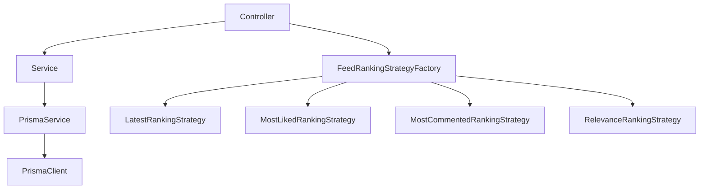
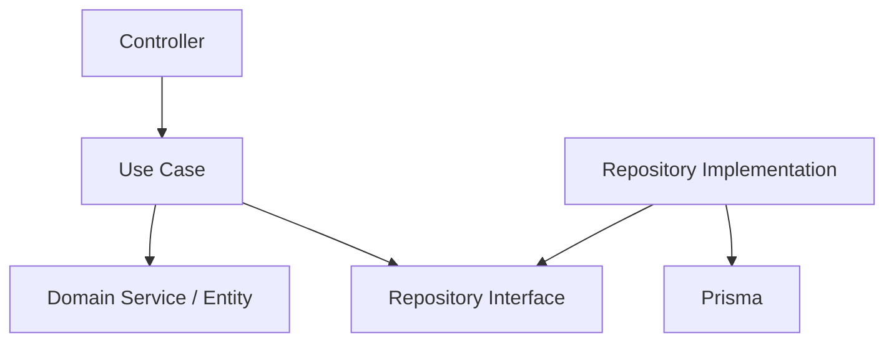
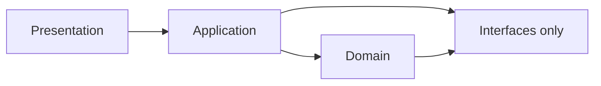
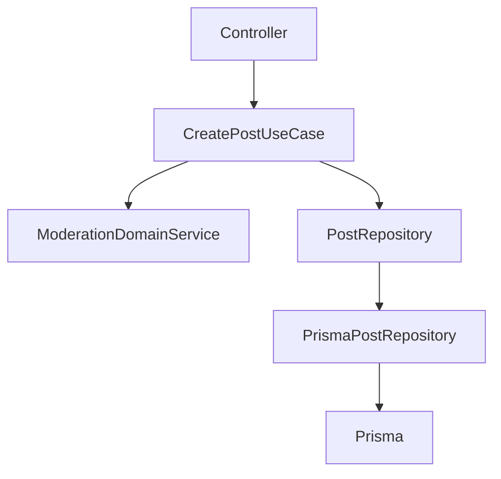
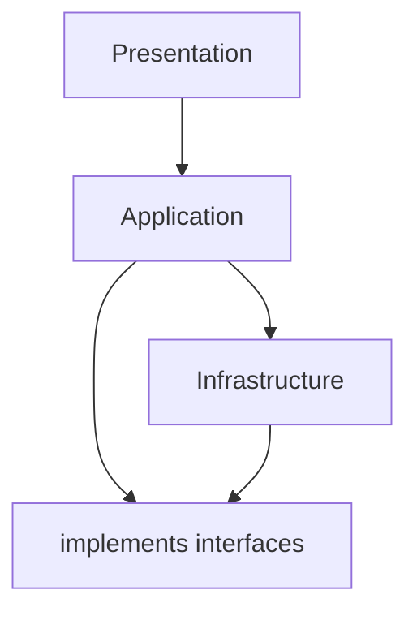

# Diagramas Mermaid

## Arquitectura Actual

```mermaid
graph TD
    Controller --> Service
    Service --> PrismaService
    PrismaService --> PrismaClient
    Controller --> FeedRankingStrategyFactory
    FeedRankingStrategyFactory --> LatestRankingStrategy
    FeedRankingStrategyFactory --> MostLikedRankingStrategy
    FeedRankingStrategyFactory --> MostCommentedRankingStrategy
    FeedRankingStrategyFactory --> RelevanceRankingStrategy
```

## Arquitectura Propuesta

```mermaid
graph TD
    Presentation[Controller] --> Application[Use Case]
    Application[Use Case] --> Domain[Domain Service / Entity]
    Application[Use Case] --> RepositoryInterface[Repository Interface]
    Infrastructure[Repository Implementation] --> RepositoryInterface
    Infrastructure[Repository Implementation] --> Prisma
```

## Flujo de dependencias

```mermaid
graph LR
    Presentation --> Application
    Application --> Domain
    Application --> Infrastructure
    Domain --> Infrastructure[Interfaces only]
```

## Flujo de casos de uso

```mermaid
graph TD
    Controller --> CreatePostUseCase
    CreatePostUseCase --> ModerationDomainService
    CreatePostUseCase --> PostRepository
    PostRepository --> PrismaPostRepository
    PrismaPostRepository --> Prisma
```

## Relación entre capas

```mermaid
graph TD
    Presentation --> Application
    Application --> Domain
    Application --> Infrastructure
    Infrastructure --> Domain[implements interfaces]
```
